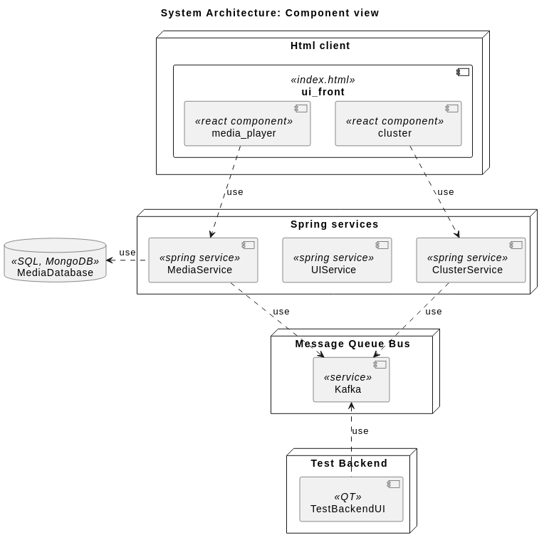
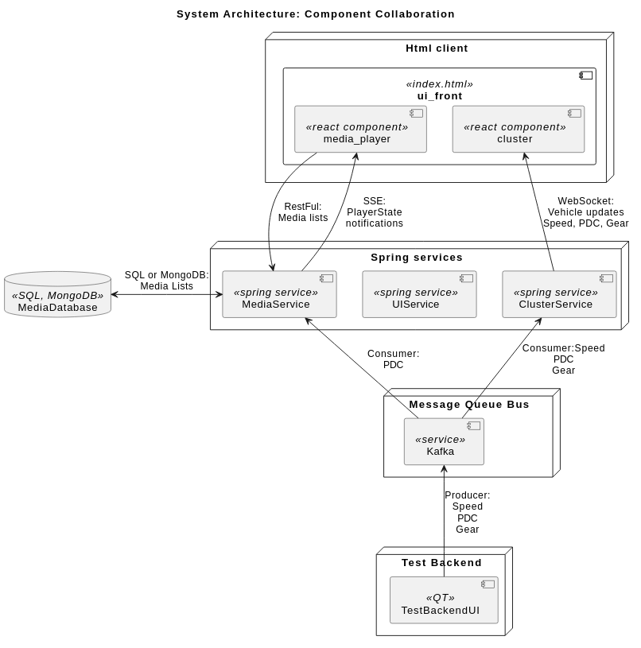

## Web Car Infortainment demo

<!-- [TOC] -->

- [Web Car Infortainment demo.](#web-car-infortainment-demo)
- [Architecture](#architecture)
  - [Component overview](#component-overview)
  - [Collaboration overview](#collaboration-overview)
- [Preconditions](#preconditions)
  - [Run Kafka](#run-kafka)
- [Build instructions](#build-instructions)
  - [Build UI frontend](#build-ui-frontend)
  - [Build all services](#build-all-services)
  - [Build qt-car-backend](#build-qt-car-backend)
- [Run Car Demo](#run-car-demo)


## Architecture
### Component overview

### Collaboration overview
The media_player React component interacts with a RESTful API to retrieve media data, such as playlists and songs, and provides playback functionality. Player state updates are delivered asynchronously via Server-Sent Events (SSE).

The cluster React component receives real-time vehicle data — including speed, Park Distance Control (PDC), and gear status — through a WebSocket connection.

On the backend, MediaService and VehicleService (Spring services) are integrated with a Kafka message bus to receive vehicle data from hardware (emulated by TestBackendUI). While VehicleService processes all incoming vehicle data, MediaService specifically consumes PDC information to pause and disable the media player when PDC is active (e.g., during reverse gear maneuvers, when audio playback may interfere with driver awareness).

MediaService supports both SQL and NoSQL (MongoDB) databases for data storage.


## Preconditions:
### Run Kafka message bus

1. Kafka Start Zookeeper
```shell
  [Kafka dist]/bin/zookeeper-server-start.sh config/zookeeper.properties
```

2. Start Kafka Broker
```shell
  [Kafka dist]/bin/kafka-server-start.sh config/server.properties
```

## Build instructions
### Build UI frontend

Build ui-front and copy it to ui-service 
```shell
  ./build-front.sh
```
or from VSCode (Ctrl-B -> Build UI-Front)

### Build all services
Build from shell
```shell
  ./build.sh
```
or from VSCode (Ctrl-B -> Build Car-Demo)

### Build qt-car-backend
Build from shell
```shell
  cd qt-car-backend
  cmake .
  make
```

## Run Car Demo
1. Run qt-car-backend
2. Run ui-service, media-service, vehicle-service in Spring Boot Dashboard
3. Open http://localhost:8080/